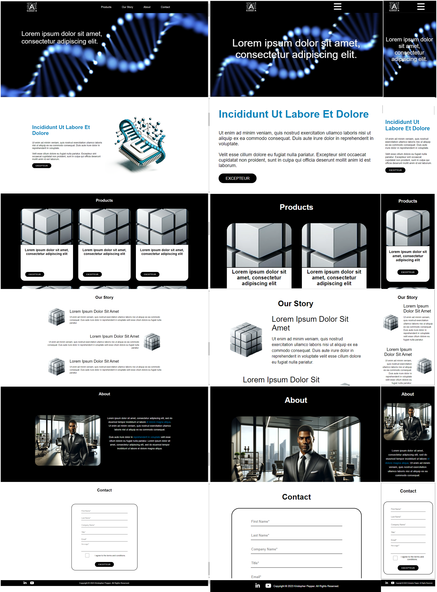

# React-Web-Application

Check out the [demo video](https://youtu.be/4BfbvbWo2OA).

### Launch the App

1) Install Node.js
2) Download the project and extract the folder.
3) Navigate to the project folder in Command Prompt.
4) Execute the command "npm install".
5) Then execute the command "npm start". The program will now launch. 
6) Open [http://localhost:3000](http://localhost:3000) to view it in your browser.

### About

- The app was created during the end of 2023.
- The aim of the project was to make a web application for a fictional company.
- The focus of the project was the front-end.
- The app was catered for both mobile and desktop view. 
